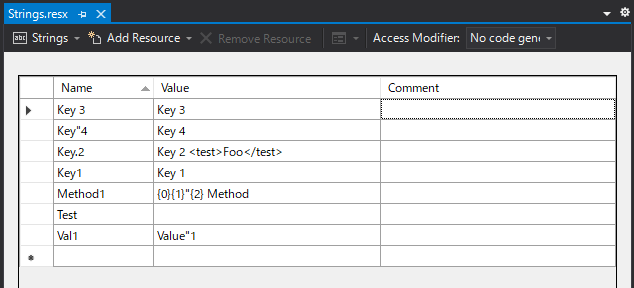

# Nut.ResxBridge

[](https://github.com/Archway-SharedLib/Nut.ResxBridge/actions)
[](https://www.nuget.org/packages/Nut.ResxBridge) 
[](https://www.nuget.org/packages/Nut.ResxBridge)

Resxファイルから型付けされたクラスを生成します。

Resx source:



Generated source:

```cs
[CompilerGenerated]
[GeneratedCode("Nut.ResxBridge", "0.1.1")]
internal static partial class Strings
{
    private static ResourceManager resourceManager = new ResourceManager(typeof(ConsoleApp1.Resources.Strings));

    private static string GetResourceString(string resourceKey, string defaultString = null)
    {
        string resourceString = null;
        try
        {
            resourceString = resourceManager.GetString(resourceKey);
        }
        catch (MissingManifestResourceException) { }

        if (defaultString != null && resourceKey.Equals(resourceString))
        {
            return defaultString;
        }

        return resourceString;
    }

    private static string Format(string resourceFormat, params object[] args)
    {
        if (args != null)
        {
            return string.Format(resourceFormat, args);
        }

        return resourceFormat;
    }

    public static string Key_3 => GetResourceString(@"Key 3", @"Key 3");
    public static string Key_4 => GetResourceString(@"Key""4", @"Key 4");
    public static string Key_2 => GetResourceString(@"Key.2", @"Key 2");
    public static string Key1 => GetResourceString(@"Key1", @"Key 1");
    public static string Method1(object _0, object _1, object _2)
            => Format(GetResourceString(@"Method1", @"{0}{1}""{2} Method"), 
                _0, _1, _2);
    public static string Val1 => GetResourceString(@"Val1", @"Value""1");

}
```

## Publicクラスを生成する

既定ではinternalなクラスを生成します。publicなクラスを生成する場合は、次のようにプロジェクトファイルに設定を行ってください。
リソースの設定をいったん消したうえで、`ResxBridge_Modifier`を`public`に指定したリソースの設定を追加しています。

```xml
<ItemGroup>
    <EmbeddedResource Remove="Resources\PublicStrings.resx" />
    <EmbeddedResource Include="Resources\PublicStrings.resx" ResxBridge_Modifier="public" />
</ItemGroup>
```

## 制限事項

- クラス名にできないファイル名では生成されません。
  - e.g. Strings.ja.resx
- ファイル名と同じキーの項目は生成されません。
- 値がないキーの項目は生成されません。(将来修正予定)
- プロパティ/メソッド名にできない値を持つキーは、NGな値が自動的に`_`に置き換えられます。
  - または先頭に付加されます。
